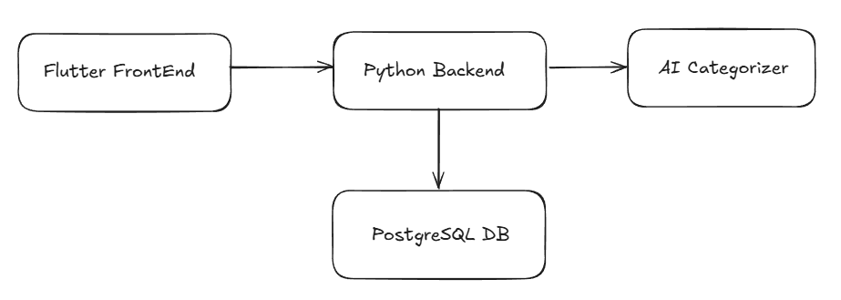
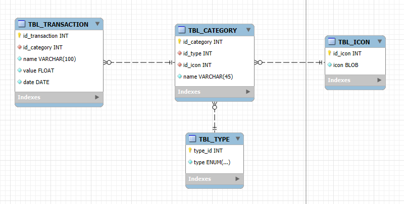

# 📊 Projeto de Categorização de Dados

Este repositório contém um projeto completo com **frontend em Flutter**, **backend em Python** e uma solução de **categorização automática de dados** utilizando **TfidfVectorizer** e o classificador **MultinomialNB**.

---

## 🛠 Tecnologias Utilizadas

- **Frontend:** Flutter
- **Backend:** Python
- **Banco de Dados:** PostgreSQL
- **Modelagem Relacional:** MySQl Workbench
- **Arquitetura do Sistema:** Excalidraw
- **Machine Learning:** TfidfVectorizer + MultinomialNB (Naive Bayes)

---

## Funcionalidade de Categorização

Foi implementado um **categorizador de dados** que utiliza:

- `TfidfVectorizer` para transformar os textos em vetores numéricos.
- `MultinomialNB` para realizar a classificação das categorias com base no conteúdo textual.

Essa solução permite classificar automaticamente entradas de texto em diferentes categorias com base em treinamento supervisionado.

---

## Interface do Usuário (Figma)

Confira o design da interface no Figma:  
🔗 [Link para o Figma](https://www.figma.com/design/qUnYM8nFudlTpfCiy3yk6T/Untitled?node-id=0-1&t=PRnPKvqfC1jWrh5l-1)

---

A arquitetura geral do sistema está ilustrada abaixo:  


---

## 🗃 Modelagem Relacional do Banco (PostgreSQL)

Veja abaixo a modelagem relacional usada no banco de dados:  


A modelagem de dados foi cuidadosamente elaborada com base em diversas [**regras de negócio**](./public/business_roles/business_roles.md), garantindo integridade, escalabilidade e aderência aos requisitos funcionais do sistema.
---

## Como Executar o Backend

1. Clone o repositório  
2. [Utilize o uv como package manager](https://github.com/astral-sh/uv)  
3. `uv venv --python versao_python` (recomendo a 3.13)  
4. `uv venv` (cria o virtual environment)  
5. `uv pip install -r requirements.txt`  
6. Configure as variáveis de ambiente: `DATABASE_URI` para o PostgreSQL  
7. Rode o backend com:  
   ```bash
   uvicorn main:app --reload --host 0.0.0.0 --port 3000
   ```

### Acesse a documentação Swagger

Depois de iniciar o backend, você pode visualizar e testar os endpoints via Swagger acessando:

```
http://localhost:3000/docs
```

## Como Executar o FrontEnd

1. Clone o repositório
2. Instale as dependências para frontend (recomendo utilizar o fvm)
3. `fvm flutter pub get`
3. Configure as variáveis de ambientes: API_URL para o backend
4. Rode o app Flutter no emulador ou dispositivo real

---

## Licença

Este projeto está licenciado sob a [MIT License](LICENSE).